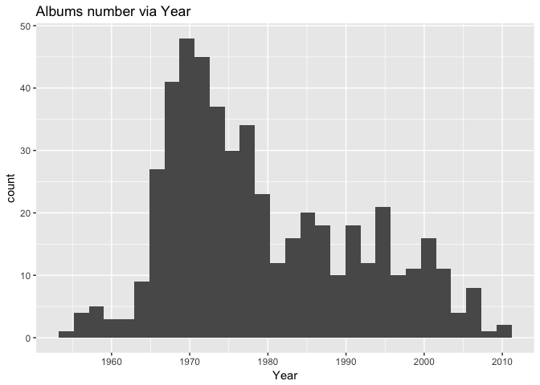
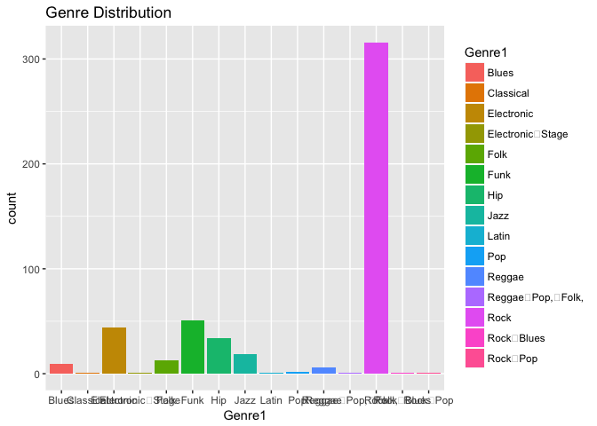
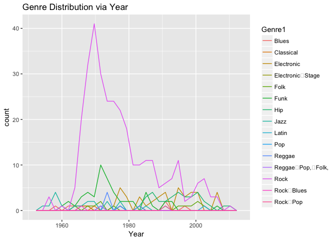

    library(tidyr)

    ## Warning: package 'tidyr' was built under R version 3.4.2

    library(tidyverse)

    ## -- Attaching packages --------------------------------------------------------- tidyverse 1.2.0 --

    ## <U+221A> ggplot2 2.2.1     <U+221A> purrr   0.2.4
    ## <U+221A> tibble  1.3.4     <U+221A> dplyr   0.7.4
    ## <U+221A> readr   1.1.1     <U+221A> stringr 1.2.0
    ## <U+221A> ggplot2 2.2.1     <U+221A> forcats 0.2.0

    ## Warning: package 'purrr' was built under R version 3.4.2

    ## Warning: package 'dplyr' was built under R version 3.4.2

    ## -- Conflicts ------------------------------------------------------------ tidyverse_conflicts() --
    ## x dplyr::filter() masks stats::filter()
    ## x dplyr::lag()    masks stats::lag()

    library(ggplot2)
    library(tidyr)
    library(stringr)

    #read data from github link
    rolling_stone=read.csv("https://raw.githubusercontent.com/dahaohanbao/rolling_stone_data/master/albumlist.csv", header=TRUE)

    #show the first 6 line from rolling_stone table
    head(rolling_stone)

    ##   Number Year                                 Album         Artist
    ## 1      1 1967 Sgt. Pepper's Lonely Hearts Club Band    The Beatles
    ## 2      2 1966                            Pet Sounds The Beach Boys
    ## 3      3 1966                              Revolver    The Beatles
    ## 4      4 1965                  Highway 61 Revisited      Bob Dylan
    ## 5      5 1965                           Rubber Soul    The Beatles
    ## 6      6 1971                       What's Going On    Marvin Gaye
    ##         Genre                      Subgenre
    ## 1        Rock Rock & Roll, Psychedelic Rock
    ## 2        Rock    Pop Rock, Psychedelic Rock
    ## 3        Rock    Psychedelic Rock, Pop Rock
    ## 4        Rock         Folk Rock, Blues Rock
    ## 5   Rock, Pop                      Pop Rock
    ## 6 Funk / Soul                          Soul

    #write csv file to locial folder
    write.csv(rolling_stone,file="/Users/Fang/Desktop/UBCcourses/522/rolling_stone_data/data/rolling_stone.csv")

    #read data file from locial folder
    rolling_stone <- read.csv("/Users/Fang/Desktop/UBCcourses/522/rolling_stone_data/data/rolling_stone.csv")

    #make a summary table for data set
    summary_rolling_stone <- summary(rolling_stone)
    summary_rolling_stone

    ##        X             Number           Year     
    ##  Min.   :  1.0   Min.   :  1.0   Min.   :1955  
    ##  1st Qu.:125.8   1st Qu.:125.8   1st Qu.:1970  
    ##  Median :250.5   Median :250.5   Median :1976  
    ##  Mean   :250.5   Mean   :250.5   Mean   :1979  
    ##  3rd Qu.:375.2   3rd Qu.:375.2   3rd Qu.:1988  
    ##  Max.   :500.0   Max.   :500.0   Max.   :2011  
    ##                                                
    ##                                  Album                    Artist   
    ##  Greatest Hits                      :  3   Bob Dylan         : 10  
    ##  Let It Be                          :  2   The Beatles       : 10  
    ##  "Love and Theft"                   :  1   The Rolling Stones: 10  
    ##  #1 Record                          :  1   Bruce Springsteen :  8  
    ##  (What's the Story) Morning Glory?  :  1   The Who           :  7  
    ##  (pronounced 'leh-'nerd 'skin-'nerd):  1   David Bowie       :  5  
    ##  (Other)                            :491   (Other)           :450  
    ##               Genre                 Subgenre  
    ##  Rock            :249   None            : 29  
    ##  Funk / Soul     : 38   Pop Rock        : 22  
    ##  Hip Hop         : 29   Soul            : 13  
    ##  Electronic, Rock: 19   Indie Rock      : 12  
    ##  Rock, Pop       : 18   Alternative Rock: 11  
    ##  Rock, Blues     : 16   Classic Rock    : 10  
    ##  (Other)         :131   (Other)         :403

    #write this summary table to locial folder
    write.csv(summary_rolling_stone,file="/Users/Fang/Desktop/UBCcourses/522/rolling_stone_data/results/summarized_rolling_stone.csv")

> We have 500 data in total. Top3 artist are Bob Dylan, The beatles and
> The Rolling Stones. Top 3 Genres are Rock Funk and Hiphop.

    rs <- read.csv("/Users/Fang/Desktop/UBCcourses/522/rolling_stone_data/data/rolling_stone.csv")

    firstplot <- ggplot(rs,aes(Year))+
      geom_histogram()+
      ggtitle("Albums number via Year")
    firstplot

    ## `stat_bin()` using `bins = 30`. Pick better value with `binwidth`.

    rs$Genre <- rs$Genre %>% 
      str_replace("[[:punct:]]","") 

    unique(rs$Genre1)

    ## NULL

    rs <- rs %>% 
      separate(Genre, into = c("Genre1","Genre2"), sep=" ") 

    secondplot <- ggplot(rs,aes(Genre1))+
      geom_bar(aes(fill=Genre1))+
      ggtitle("Genre Distribution")
    secondplot

    thirdplot <- ggplot(rs,aes(x=Year))+
      geom_freqpoly(aes(color=Genre1))+
      ggtitle("Genre Distribution via Year")
    thirdplot

    ## `stat_bin()` using `bins = 30`. Pick better value with `binwidth`.

    ggsave("results/firstplot.pdf",firstplot)

    ## Saving 7 x 5 in image
    ## `stat_bin()` using `bins = 30`. Pick better value with `binwidth`.

    ggsave("results/secondplot.pdf",secondplot)

    ## Saving 7 x 5 in image

    ggsave("results/thirdlot.pdf",thirdplot)

    ## Saving 7 x 5 in image
    ## `stat_bin()` using `bins = 30`. Pick better value with `binwidth`.

> From the Albums unmber via Year plot, we can see that from 1965 to
> 1980 is the most productive age of rolling stone and in 1970 rolling
> stone released the most albums.

> From the Second plot, we can see that Rock music is the most music
> genre that released by rolling stone.

> From the third plot, we can see that rock music had big wave, which
> means that music genres that rolling stone release are different in
> different age.
