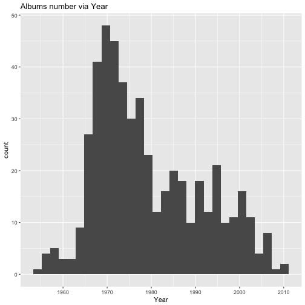
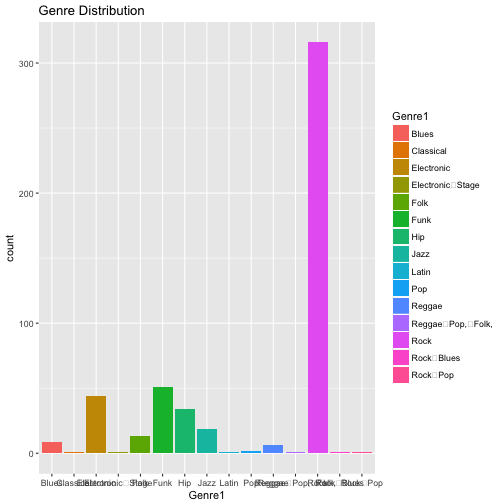
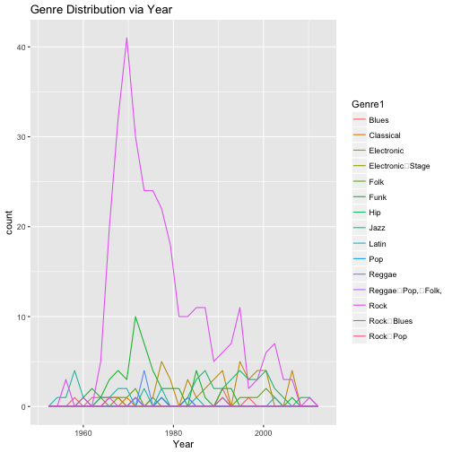

```r
library(tidyr)
library(tidyverse)
library(ggplot2)
library(tidyr)
library(stringr)
library(ezknitr)

#read data from github link
rolling_stone <- read.csv("https://raw.githubusercontent.com/dahaohanbao/rolling_stone_data/master/albumlist.csv", header=TRUE)

#show the first 6 line from rolling_stone table
head(rolling_stone)
```

```
##   Number Year                                 Album         Artist
## 1      1 1967 Sgt. Pepper's Lonely Hearts Club Band    The Beatles
## 2      2 1966                            Pet Sounds The Beach Boys
## 3      3 1966                              Revolver    The Beatles
## 4      4 1965                  Highway 61 Revisited      Bob Dylan
## 5      5 1965                           Rubber Soul    The Beatles
## 6      6 1971                       What's Going On    Marvin Gaye
##         Genre                      Subgenre
## 1        Rock Rock & Roll, Psychedelic Rock
## 2        Rock    Pop Rock, Psychedelic Rock
## 3        Rock    Psychedelic Rock, Pop Rock
## 4        Rock         Folk Rock, Blues Rock
## 5   Rock, Pop                      Pop Rock
## 6 Funk / Soul                          Soul
```


```r
#read data file from locial folder


#make a summary table for data set
summary_rolling_stone <- summary(rolling_stone)
summary_rolling_stone
```

```
##      Number           Year                                      Album    
##  Min.   :  1.0   Min.   :1955   Greatest Hits                      :  3  
##  1st Qu.:125.8   1st Qu.:1970   Let It Be                          :  2  
##  Median :250.5   Median :1976   "Love and Theft"                   :  1  
##  Mean   :250.5   Mean   :1979   #1 Record                          :  1  
##  3rd Qu.:375.2   3rd Qu.:1988   (What's the Story) Morning Glory?  :  1  
##  Max.   :500.0   Max.   :2011   (pronounced 'leh-'nerd 'skin-'nerd):  1  
##                                 (Other)                            :491  
##                 Artist                 Genre                 Subgenre  
##  Bob Dylan         : 10   Rock            :249   None            : 29  
##  The Beatles       : 10   Funk / Soul     : 38   Pop Rock        : 22  
##  The Rolling Stones: 10   Hip Hop         : 29   Soul            : 13  
##  Bruce Springsteen :  8   Electronic, Rock: 19   Indie Rock      : 12  
##  The Who           :  7   Rock, Pop       : 18   Alternative Rock: 11  
##  David Bowie       :  5   Rock, Blues     : 16   Classic Rock    : 10  
##  (Other)           :450   (Other)         :131   (Other)         :403
```

>We have 500 data in total. Top3 artist are Bob Dylan, The beatles and The Rolling Stones. Top 3 Genres are Rock Funk and Hiphop.


```r
rs <- rolling_stone

firstplot <- ggplot(rs,aes(Year))+
  geom_histogram()+
  ggtitle("Albums number via Year")
firstplot
```

```
## `stat_bin()` using `bins = 30`. Pick better value with `binwidth`.
```



>From the Albums unmber via Year plot, we can see that from 1965 to 1980 is the most productive age of rolling stone and in 1970 rolling stone released the most albums.


```r
rs$Genre <- rs$Genre %>% 
  str_replace("[[:punct:]]","") 

unique(rs$Genre1)
```

```
## NULL
```

```r
rs <- rs %>% 
  separate(Genre, into = c("Genre1","Genre2"), sep=" ") 
```

```
## Warning: Too many values at 123 locations: 6, 19, 20, 24, 25, 31, 38, 45,
## 52, 54, 57, 58, 61, 65, 66, 68, 71, 72, 75, 76, ...
```

```
## Warning: Too few values at 280 locations: 1, 2, 3, 4, 7, 8, 10, 11, 12, 13,
## 14, 16, 17, 18, 21, 22, 23, 26, 27, 28, ...
```

```r
secondplot <- ggplot(rs,aes(Genre1))+
  geom_bar(aes(fill=Genre1))+
  ggtitle("Genre Distribution")
secondplot
```




>From the Second plot, we can see that Rock music is the most music genre that released by rolling stone.


```r
thirdplot <- ggplot(rs,aes(x=Year))+
  geom_freqpoly(aes(color=Genre1))+
  ggtitle("Genre Distribution via Year")
thirdplot
```

```
## `stat_bin()` using `bins = 30`. Pick better value with `binwidth`.
```



>From the third plot, we can see that rock music had big wave, which means that music genres that rolling stone release are different in different age.
